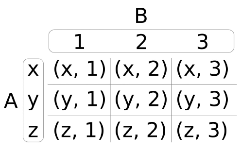

# Generating cartesian product pairs of any input at compile time

The cartesian product is a mathematial operation. It is noted as __A x B__ meaning the cartesian product of set __A__ and set __B__.
The result is another single set, which contains pairs of _all_ item combinations of the sets __A__ and __B__.
The operation basically means: combine every items from __A__ with every items from __B__.



Example below illustrates the implementation of a functional object (closeure of lambda expression) that accepts an abitrary number of input parameters and generates cartesian product of this set with _itself_
```cpp
   constexpr auto C = cartesian::product_itself(1,2,3);
   //       -1-    -2-   -3-
   // -1-  (1,1)  (1,2) (1,3)
   // -2-  (2,1)  (2,2) (2,3)
   // -3-  (3,1)  (3,2) (3,3)
```
that can be printed to terminal like that:
```cpp
void print(int x, int y)
{
   cout <<"("<<x<<","<<y<<")";
}
C(print);
```

## Further informations
* [Cartesian product](https://en.wikipedia.org/wiki/Cartesian_product) on Wikipedia
* [Cartesian product at compile time in C++](https://books.google.com.ua/books?id=bqdWDwAAQBAJ&pg=PA641&lpg=PA641&dq=cartesian+product+C%2B%2B+compile+time&source=bl&ots=MGAh9W4yMq&sig=PxV2ARz7zAK-bg-UltCmqBM-58I&hl=en&sa=X&ved=0ahUKEwj_ofXv3K_bAhUHBHwKHU1BB0MQ6AEIOTAD#v=onepage&q&f=false) by Jacek Galowicz

## Related links
* [inner product](../lambda_inner) at compile time
* [Other examples of compile time computing](../../constexpr)

## Compilers
* [GCC 8.1.0](https://wandbox.org/)
* [clang 6.0.0](https://wandbox.org/)
* Microsoft (R) C/C++ Compiler 19.14 
