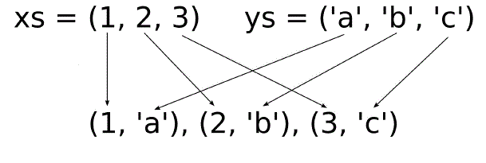

# Generating inner product of any input at compile time

Let's consider this example as a compile-time analog of the run-time STL algorithm [`std::inner_product`](https://en.cppreference.com/w/cpp/algorithm/inner_product)
A meaning of it can be shown as



with a map in the code:
```cpp
   constexpr auto prod = inner_product(1,2,3)('a','b','c');
```
that can be printed to terminal like that:
```cpp
   prod([](int x, char y) { 
      cout << "{" << x << "," << y << "}"; 
   });
```

## Further informations
* [Dot product](https://en.wikipedia.org/wiki/Dot_product) on Wikipedia
* [`std::inner_product`](https://en.cppreference.com/w/cpp/algorithm/inner_product)

## Related links
* [cartesian product](../lambda_cartesian) at compile time

## Compilers
* [GCC 8.1.0](https://wandbox.org/)
* [clang 6.0.0](https://wandbox.org/)
* Microsoft (R) C/C++ Compiler 19.14 
