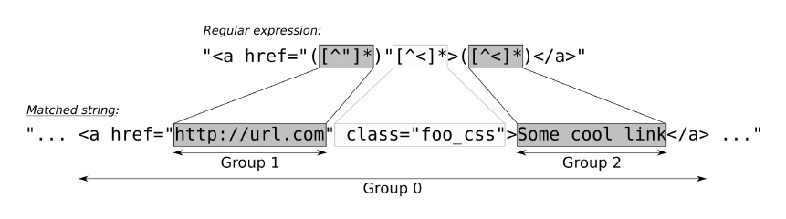

# Tokenizing input with the regular expression library.
When parsing or transforming strings in complex ways or breaking them into chunks, _regular expressions_ are a great help. In many programming languages, they are already built in because they are so useful and handy. 
Let's suppose we need extract all the links out of an HTML file and list them for the user. 
Because of C++ STL since C++11 has already support _regular expression_ code will be amazingly short and clear.
```cpp
const regex reg{"<a href=\"([^\"]*)\"[^<]*>([^<]*)</a>"};
sregex_iterator it{begin(in), end(in), reg};      
for (; it != sregex_iterator{}; ++it)
   cout << it->str(2) << ":\t" << it->str(1) << endl;   
```
where 'in' is a content of the specified input file.
Btw, there is another way how it can be done with the same output. Depending on context you are trying to enumerate all matches from it can be more preferable than the first one.
```cpp
sregex_token_iterator it{begin(in), end(in), reg, {1,2}};      
while (it != sregex_token_iterator{}) {
   const string link{*it++};
   const string dest{*it++};
   cout << dest << ":\t" << link << endl;
}
```
_Regular expressions_ (or _regex_ in short) are extremely useful. 
They can look really cryptic, but it is worth learning how they work. A short regex can spare us writing many lines of code if we did the matching manually. 
Regular expressions are another large topic, and there are great explanations on [Wikipedia](https://en.wikipedia.org/wiki/Regular_expression) and other websites or literature. 
Let's have another look at our regular expression that matches what we assume to be HTML links. 
A simple HTML link can look like `<a href="some_url.com/foo">A great link</a>`.
We want the `some_url.com/foo` part, as well as `A great link`.
So we came up with the following _regular expression_, which contains _groups_ for matching substrings:  

The whole match itself is always __Group 0__. In this case, this is the full `<a href ..... </a>` string. 
The quoted `href`-part that contains the URL being linked to is __Group 1__. 
The `( )` parentheses in the regular expression define such a __group__ of which we have __2__. 
The other one is the part between the `<a ...>` and `</a>`, which contains the link description.

## Further informations
* [Regular expressions library](https://en.cppreference.com/w/cpp/regex)
* [Modified ECMAScript regular expression grammar](https://en.cppreference.com/w/cpp/regex/ecmascript)
* [C++ Regex 101](https://www.fluentcpp.com/2020/02/28/c-regex-101-simple-code-for-simple-cases-with-regexes/) by Jonathan Boccara

## Related links
* [Regular expressions. for_each algorithm](https://github.com/nikolaAV/skeleton/tree/master/algorithm/regex_for_each)

## Compilers
* [GCC 8.1.0](https://wandbox.org/)
* [clang 6.0.0](https://wandbox.org/)
* Visual C++ 19.14 
