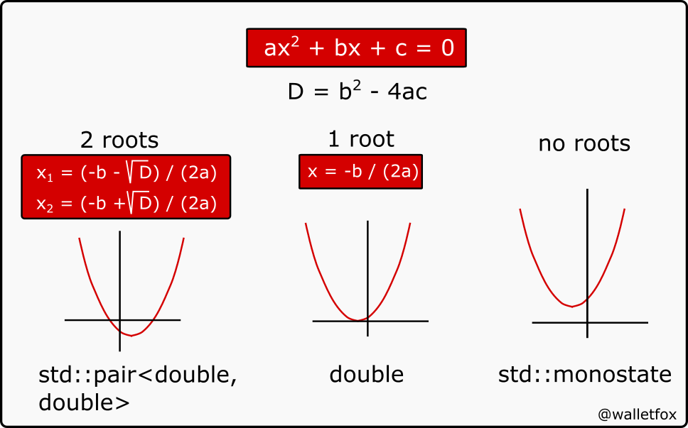

# C++17 Pattern matching on type
C++ have very powerfull tool - templates. But work with tepmlates contains large amount of boilerplate code, which does not contains actual logic. 
If we have some set of functions coming with external API like this:
```cpp
namespace api {
    CallIntMethod(int v, ....);    
    CallFloatMethod(float v, ....);    
    CallVoidMethod(....);    
}
```
we will probably need to make a wrapper for each of them to be able provide a generic invocation mechanism:
```cpp
void helper(int v){
   api::CallIntMethod(v, ....);
}

void helper(float v){
   api::CallFloatMethod(v, ....);
}

void helper(nullptr_t){
    api::CallVoidMethod(....);
}

template<class T>
void call(T v){
     helper(v);
}
```
With pattern mathing on type this would look like this:
```cpp
template<class T>
void call(T value){
     match(value   // <--- C++ doesn't have pattern matching mechanism/syntax. Not yet...
        ,[](int v) {api::CallIntMethod(v, ....);}
        ,[](float v) {api::CallFloatMethod(v, ....);}
        ,[](nullptr_t) {api::CallVoidMethod(....);}
     );
}
```
### Practical examples of the basic pattern-matching capability of C++17 with [`std::variant`](https://en.cppreference.com/w/cpp/utility/variant), [`std::visit`](https://en.cppreference.com/w/cpp/utility/variant/visit) and [`std::monostate`](https://en.cppreference.com/w/cpp/utility/variant/monostate). 
This example presents the solution of a [quadratic equation](https://en.wikipedia.org/wiki/Quadratic_formula), which has either 2, 1 or 0 roots in the real number domain.  
  
In the code, that can be represented by different types:
```cpp
using _1root_type  = double;
using _2roots_type = std::pair<double,double>;
using _0root_type  = std::monostate;
using result_type  = std::variant<_0root_type, _1root_type, _2roots_type>;
```
A non-existent solution is represented by `std::monostate()` which is used for cases when `std::variant` does not contain a value. 
We are going to use a type alias __result_type__ for our variant to make the code more readable. 
To simplify type matching with `std::visit`, we introduce a hint [overloaded](../../lambda/lambda_overloaded) that guides the deduction of template arguments supplied to the constructor. 
The computation itself can be written as:
```cpp
result_type compute(double a, double b, double c) noexcept {
   const auto discriminant = b*b-4*a*c;
   const auto denominator  = 2*a;
   if (0. < discriminant) {
      const auto square       = std::sqrt(discriminant);
      return _2roots_type{(-b+square)/denominator,(-b-square)/denominator};
   }
   if (0. == discriminant)
      return _1root_type{-b/denominator};
   return _0root_type{};
}
```
and the final result handling like this:
```cpp
std::visit(
    overloaded{
       [](const _2roots_type& v) { cout << "2 real roots found: " << v.first << "," << v.second; }
      ,[](const _1root_type& v)  { cout << "1 real root found: " << v; }
      ,[](const _0root_type&  )  { cout << "no real root found"; }
   }
   ,compute(a,b,c,)
);
```

## Further informations
* [Open Pattern Matching for C++](http://www.stroustrup.com/OpenPatternMatching.pdf) by Yuriy Solodkyy, Gabriel Dos Reis, Bjarne Stroustrup
* [Pattern Matching, P1260R0](http://www.open-std.org/jtc1/sc22/wg21/docs/papers/2018/p1260r0.pdf) by Michael Park
* [Variant Visitation](https://mpark.github.io/programming/2015/07/07/variant-visitation/)
* [Let’s overload lambdas!](https://arne-mertz.de/2018/05/overload-build-a-variant-visitor-on-the-fly/) by Arne Mertz
* [Roots of a quadratic equation](https://www.walletfox.com/course/patternmatchingcpp17.php) on walletfox.com

## Related links
* [Overloaded Lambdas](../../lambda/lambda_overloaded)

[back to 'variant' section](../)

## Supported Compilers
* Microsoft (R) C/C++ Optimizing Compiler Version 19.16.xyz with option /std:c++17
* GCC 8.1.0
* Clang 7.0.0

