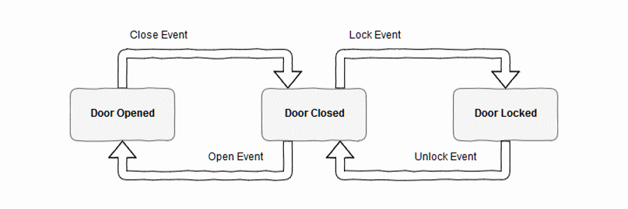

# State machines are represented by means [`std::variant`](https://en.cppreference.com/w/cpp/utility/variant) (C++17)
Let's each separate state be represented by singular C++ type. 
The main motivation is to make illegal states unrepresentable by embedding the variables only needed in one state inside a C++ type representing the state.  
All the C++ types are then combined in a std::variant object to represent the current state. 
For example door’s state

shows that there are three possible states and four events which can be applicable. 
Please also note the each particular event can be accepted if the door has an appropriate state. 
* Door Opened -> CloseEvent -> Door Closed
* Door Closed -> OpenEvent -> Door Opened
* Door Closed -> LockEvent -> Door Locked
* Door Locked -> UnlockEvent -> Door Closed
```cpp
namespace state
{
   struct opened {};
   struct closed {};
   struct locked {};
   using  type = std::variant<opened, closed, locked>;
}   // end of state

namespace event
{
   struct open {
      template <typename T>
      state::type operator()(T)             { return T{}; }; // do nothing
      state::type operator()(state::closed) { return state::opened{}; }
   };

   struct close {
      ...
      state::type operator()(state::opened) { return state::closed{}; }
   };

   struct lock {
      ...
      state::type operator()(state::closed) { return state::locked{}; }
   };

   struct unlock {
      ...
      state::type operator()(state::locked) { return state::closed{}; }
   };

} // end of event
```
that is all. Play with it.
```cpp
state::type s;
// <--- state::opened
s = visit(event::lock{},s);
// <--- state::opened, do nothing
s = visit(event::close{},s);
// <--- state::closed
s = visit(event::lock{},s);
// <--- state::locked
s = visit(event::unlock{},s);
// <--- state::closed
```

## Further informations
* [Implementing State Machines with std::variant](http://khuttun.github.io/2017/02/04/implementing-state-machines-with-std-variant.html) by Kalle Huttunen
* [Using Types Effectively](https://www.youtube.com/watch?v=ojZbFIQSdl8) by Ben Deane on 2016 CppCon
* [Everything You Need to Know About std::variant from C++17](https://www.bfilipek.com/2018/06/variant.html#state-machines) by Bartlomiej Filipek

## Related links

[back to 'variant' section](../)

## Supported Compilers
* Microsoft (R) C/C++ Optimizing Compiler Version 19.16.xyz with option /std:c++17
* GCC 8.1.0
* Clang 7.0.0

